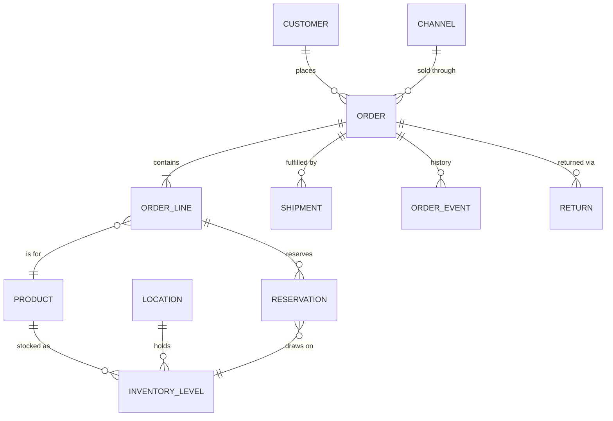

# Domain model (draft)

Phase 0 deliverable: the entities Phase 1 builds. In code so far: `User` and `ApiKey`; `Customer` with `CustomerAddress` and `CustomerEvent` (customers); `Product`, `Location`, `InventoryLevel` and `InventoryMovement` (catalog and inventory); and `Channel`, `Order`, `OrderLine`, `OrderTag` and `OrderEvent` (orders). The rest is a draft. Names and fields will change as Phase 1 lands; update this file when they do.



| Entity | Purpose | Key fields |
|---|---|---|
| User | Signs in to the web UI | email, name, roles, enabled |
| Channel | Where an order came from (manual, CSV, Shopify…) | code, name, type, currency (default for new orders); `manual` is seeded |
| Customer | Buyer | email (unique, case-insensitive), name, phone |
| CustomerAddress | A customer's billing or shipping address; several of each, one default per type | type, is_default, recipient, company, lines, postal_code, city, region, country_code (ISO 3166-1), phone |
| CustomerEvent | Audit trail of customer changes | customer, type (created/updated), actor, changes (before/after per field), occurred_at |
| Order | The core object | number (from a sequence, 10001 up; gaps possible), channel, status, held_from, payment_status (`unpaid`, `authorized`, `paid`, `refunded`, `partially_refunded`; set by hand in Phase 1, never card data), currency, customer copied on (name, email, shipping/billing address, optional customer_id, not a foreign key yet), total_amount (minor units), placed_at, version |
| OrderLine | One SKU on an order: SKU, name and price copied, linked to its Product by SKU | position, product, sku_code, name, quantity (ordered, as last edited), unit_price, line_total (minor units: unit_price × (quantity − cancelled_quantity)), reserved_quantity, shipped_quantity, cancelled_quantity; shipped + cancelled ≤ quantity, and while the order holds stock reserved = quantity − shipped − cancelled (ADR-0011) |
| Product (SKU) | What is sold and stocked | sku (fixed once created), name, barcode, weight_grams, version |
| Location | Warehouse or store | code (fixed once created), name, address, version |
| InventoryLevel | Stock of one SKU at one location | on_hand, reserved (available = on_hand − reserved; 0 ≤ reserved ≤ on_hand), version |
| InventoryMovement | Append-only history of every level change | product, location, type, reason, note, on_hand/reserved before and after, actor, occurred_at |
| Reservation | Stock held for an order line — in code, `order_line.reserved_quantity` at the order's `location` (one location per order in Phase 1; ADR-0005) | order_line, location, quantity |
| Shipment | A parcel leaving the order's location: some lines, or part of a line (ADR-0009) | order, location, lines (order_line, quantity), carrier, tracking_number (typed in; both optional), shipped_at, actor; `order_line.shipped_quantity` counts what has left |
| OrderTag | A free-text label on an order, for filtering and bulk work (ADR-0010) | order, name (1–64 characters, no comma; unique per order ignoring case); at most 20 per order |
| OrderEvent | Audit trail: creation, every state change, shipments, notes, tag and payment status changes | order, type (`created`, `transition`, `shipment`, `shipment_corrected`, `shipment_voided`, `note`, `tags_changed`, `payment_status_changed`, `edited`, `lines_cancelled`), transition, actor + actor name, before/after, occurred_at |
| Document | A generated PDF for an order, or for several (pick lists, packing slips), and the job that makes it | type, order, order_version (null for several), batch_orders (id, number, version of each) and batch_key for several, locale, status (queued/running/done/failed), storage_key, requested_by |
| Return | Phase 3 | — |

## Order states

```
pending → confirmed → allocated → picking → packed → shipped → delivered
   any pre-shipment state → cancelled | on_hold (and back)
   release: on_hold → the status it was held from (held_from)
```

Transitions go through the state machine only (`Domain/Order/OrderStateMachine`; `Order::apply()` is the only way to change a status, and it writes the event in the same flush). Shipped, delivered and cancelled orders cannot be cancelled or held.

**Editing and partial cancel (ADR-0011).** An order can be edited (line quantities, lines added or removed, customer name and email, addresses) while it is pending, confirmed or allocated, or on hold from one of those, and nothing has shipped; the reservation follows the lines in the same transaction. Units that have not shipped can be cancelled in any status that can be cancelled; the line keeps them as `cancelled_quantity`. When every unit is shipped or cancelled, the order finishes through the state machine: `ship` if any of it shipped, otherwise `cancel`.

## Rules

- Money is an integer in minor units plus an ISO 4217 code; never a float.
- Every order and inventory change writes an `OrderEvent` (or an inventory movement) in the same transaction.
- `Order.version` gives optimistic locking, so two operators cannot silently overwrite each other.
