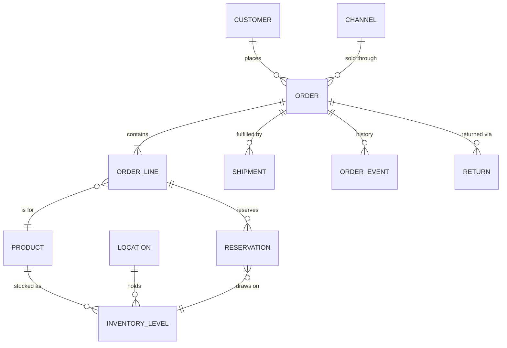

# Domain model (draft)

Phase 0 deliverable: the entities Phase 1 builds. Only `User` exists in code today. Names and fields will change as Phase 1 lands; update this file when they do.



| Entity | Purpose | Key fields |
|---|---|---|
| User | Signs in to the web UI | email, name, roles, enabled |
| Channel | Where an order came from (manual, CSV, Shopify…) | code, type, currency |
| Customer | Buyer | email, name, addresses |
| Order | The core object | number, channel, customer, status, currency, totals (minor units), placed_at, version |
| OrderLine | One SKU on an order | sku, quantity, unit_price (minor units), quantity_shipped |
| Product (SKU) | What is sold and stocked | sku, name, barcode, weight |
| Location | Warehouse or store | code, name, address |
| InventoryLevel | Stock of one SKU at one location | on_hand, reserved (available = on_hand − reserved) |
| Reservation | Stock held for an order line | order_line, inventory_level, quantity |
| Shipment | A parcel leaving a location | order, lines, carrier, tracking_number, shipped_at |
| OrderEvent | Audit trail: every state change | order, type, actor, before/after, occurred_at |
| Return | Phase 3 | — |

## Order states

```
pending → confirmed → allocated → picking → packed → shipped → delivered
   any pre-shipment state → cancelled | on_hold (and back)
```

Transitions go through the state machine only. Confirming an order reserves stock in the same transaction.

## Rules

- Money is an integer in minor units plus an ISO 4217 code; never a float.
- Every order and inventory change writes an `OrderEvent` (or an inventory movement) in the same transaction.
- `Order.version` gives optimistic locking, so two operators cannot silently overwrite each other.
