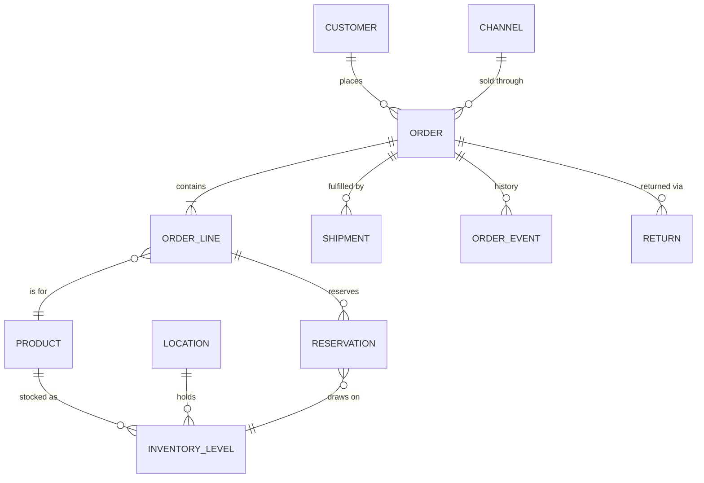

# Domain model (draft)

Phase 0 deliverable: the entities Phase 1 builds. In code so far: `User` and `ApiKey`; `Customer` with `CustomerAddress` and `CustomerEvent` (customers); `Product`, `Location`, `InventoryLevel` and `InventoryMovement` (catalog and inventory); and `Channel`, `Order`, `OrderLine` and `OrderEvent` (orders). The rest is a draft. Names and fields will change as Phase 1 lands; update this file when they do.



| Entity | Purpose | Key fields |
|---|---|---|
| User | Signs in to the web UI | email, name, roles, enabled |
| Channel | Where an order came from (manual, CSV, Shopify…) | code, name, type, currency (default for new orders); `manual` is seeded |
| Customer | Buyer | email (unique, case-insensitive), name, phone |
| CustomerAddress | A customer's billing or shipping address; several of each, one default per type | type, is_default, recipient, company, lines, postal_code, city, region, country_code (ISO 3166-1), phone |
| CustomerEvent | Audit trail of customer changes | customer, type (created/updated), actor, changes (before/after per field), occurred_at |
| Order | The core object | number (from a sequence, 10001 up; gaps possible), channel, status, held_from, currency, customer copied on (name, email, shipping/billing address, optional customer_id, not a foreign key yet), total_amount (minor units), placed_at, version |
| OrderLine | One SKU on an order, copied, not linked to Product yet | position, sku_code, name, quantity, unit_price, line_total (minor units); quantity_shipped comes with shipments |
| Product (SKU) | What is sold and stocked | sku (fixed once created), name, barcode, weight_grams, version |
| Location | Warehouse or store | code (fixed once created), name, address, version |
| InventoryLevel | Stock of one SKU at one location | on_hand, reserved (available = on_hand − reserved; 0 ≤ reserved ≤ on_hand), version |
| InventoryMovement | Append-only history of every level change | product, location, type, reason, note, on_hand/reserved before and after, actor, occurred_at |
| Reservation | Stock held for an order line — in code, `order_line.reserved_quantity` at the order's `location` (one location per order in Phase 1; ADR-0005) | order_line, location, quantity |
| Shipment | A parcel leaving a location | order, lines, carrier, tracking_number, shipped_at |
| OrderEvent | Audit trail: creation and every state change | order, type (`created`, `transition`), transition, actor + actor name, before/after, occurred_at |
| Document | A generated PDF for an order (pick list, packing slip) and the job that makes it | type, order, order_version, locale, status (queued/running/done/failed), storage_key, requested_by |
| Return | Phase 3 | — |

## Order states

```
pending → confirmed → allocated → picking → packed → shipped → delivered
   any pre-shipment state → cancelled | on_hold (and back)
   release: on_hold → the status it was held from (held_from)
```

Transitions go through the state machine only (`Domain/Order/OrderStateMachine`; `Order::apply()` is the only way to change a status, and it writes the event in the same flush). Shipped, delivered and cancelled orders cannot be cancelled or held.

**Not yet:** confirming an order must reserve stock in the same transaction. Orders are not linked to products yet, so confirm changes the status only; the reservation is wired in when order lines link to products (marked `TODO(inventory)` in `Order::apply()`).

## Rules

- Money is an integer in minor units plus an ISO 4217 code; never a float.
- Every order and inventory change writes an `OrderEvent` (or an inventory movement) in the same transaction.
- `Order.version` gives optimistic locking, so two operators cannot silently overwrite each other.
